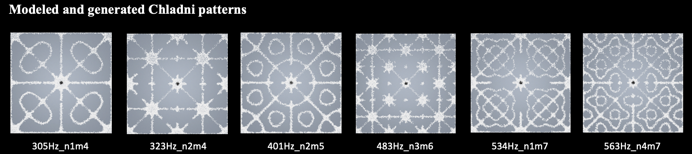
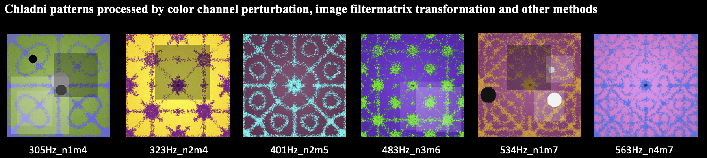
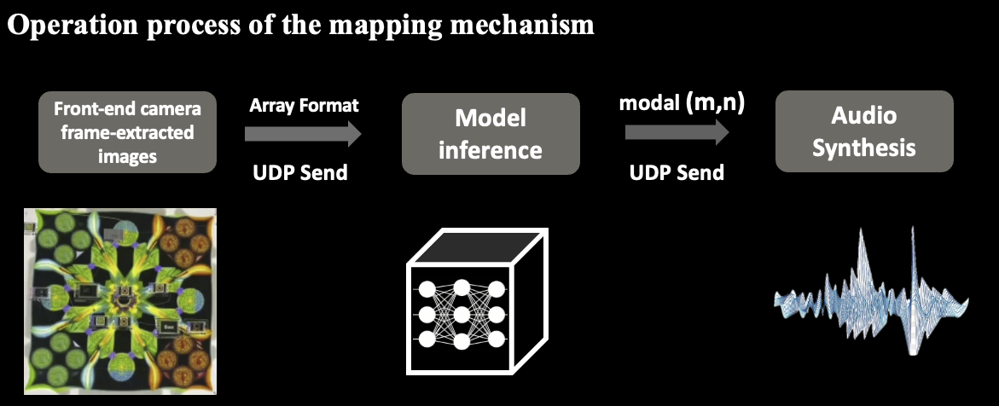

# ChladniSonify: Real-Time Visual-Acoustic Mapping Library for Chladni New Media Art

ChladniSonify is an academic research codebase for generating Chladni-pattern datasets, training visual recognition models, evaluating inference performance, and supporting real-time visual-acoustic mapping experiments. The repository focuses on the model-training pipeline and the visual-acoustic mapping algorithm source code associated with Chladni-pattern sonification.

> Project status: research prototype and reproducibility package.

## Project Scope and Research Attribution

This repository contains the source code and data-processing pipeline for:

- formula-driven Chladni pattern generation;
- data augmentation for visual recognition experiments;
- CNN, AlexNet, VGG16, and CBAM-enhanced CNN model training;
- model evaluation, accuracy reporting, and inference-latency measurement;
- lightweight socket-based mapping support for real-time visual-acoustic experiments.

This repository does **not** claim ownership of the accompanying interactive hardware installation or the VST3 visual-acoustic mapping plugin as part of the same paper. Those components belong to a separate research output and should be cited, linked, and described independently.

### Related Repositories

The following placeholders are reserved for cross-referencing the two associated research projects:

- Model training and visual-acoustic mapping algorithm source code: `TODO: add repository URL for this project`
- Interactive hardware installation and VST3 visual-acoustic mapping plugin: `TODO: add repository URL for the companion project`

When both repositories are publicly available, please add reciprocal links in both README files.

## Paper and Dataset

- arXiv paper: [https://arxiv.org/abs/2605.09846](https://arxiv.org/abs/2605.09846)
- Zenodo dataset/software record: [https://zenodo.org/records/21730609](https://zenodo.org/records/21730609)
- DOI: [10.5281/zenodo.21730609](https://doi.org/10.5281/zenodo.21730609)
- License of the Zenodo record: Creative Commons Attribution 4.0 International, as stated on the Zenodo page.

## Abstract

Existing visual-audio mapping schemes for new media art often depend on subjective mapping rules, costly physical simulation, or insufficient real-time performance. This project provides a research pipeline for Chladni-pattern sonification based on thin-plate vibration theory, image-frequency dataset generation, and deep-learning-based visual recognition.

Guided by Kirchhoff-Love thin-plate vibration theory, paired Chladni image-frequency samples are generated and augmented for model training. Multiple neural-network variants are included for comparative experiments, including baseline CNN, AlexNet, VGG16, and CBAM-enhanced CNN architectures. The resulting recognition model can be used as the visual front end of a real-time visual-acoustic mapping system.

## Visual Overview

### Generated Chladni Pattern Samples



Formula-driven Chladni vibration samples generated from thin-plate physical equations.

### Data Augmentation Samples



Augmented samples produced through color perturbation, image noise, local matrix filtering, and geometric transformations.

### Mapping Workflow



End-to-end workflow of the proposed visual-acoustic mapping pipeline.

## Repository Structure

The repository contains several parallel experiment folders. Each folder follows a similar internal layout but targets a different model architecture or CBAM configuration.

```text
.
├── kladni_model_classification /
│   ├── data/
│   │   ├── raw/                 # Chladni pattern generation and augmentation scripts
│   │   ├── generated/           # Generated images and labels before splitting
│   │   └── processed/           # Train/validation/test datasets
│   ├── model/                   # Basic CNN model, training, and evaluation scripts
│   ├── scripts/                 # Dataset split utilities
│   └── chladni_server.py        # Socket-based inference/mapping server prototype
├── kladni_model_alex/
│   ├── data/
│   ├── model/                   # AlexNet-based experiment
│   └── scripts/
├── kladni_model_vgg 3.0/
│   ├── data/
│   ├── model/                   # VGG16-based experiment
│   └── scripts/
├── kladni_cbam 5x5/
│   ├── data/
│   ├── model/                   # CBAM-CNN experiment with 5x5 configuration
│   └── scripts/
├── kladni_cbam 7x7/
│   ├── data/
│   ├── model/                   # CBAM-CNN experiment with 7x7 configuration
│   └── scripts/
├── gen_chladni.jpg
├── aug_chladni.jpg
├── mapping_flow.jpg
├── LICENSE
└── README.md
```

## Environment Configuration

### Python Version

Recommended Python version:

- Python 3.9

The repository contains compiled cache files generated under Python 3.9, and the codebase is written for the PyTorch/torchvision ecosystem commonly used with Python 3.9. Python 3.8-3.11 may also work if compatible versions of PyTorch, torchvision, SciPy, scikit-learn, Pillow, NumPy, and Matplotlib are installed.

### Core Dependencies

The project does not currently include a pinned `requirements.txt`. Install the following third-party libraries according to your operating system and hardware acceleration environment:

- `numpy`
- `scipy`
- `matplotlib`
- `Pillow`
- `scikit-learn`
- `torch`
- `torchvision`

For CPU-only use, install PyTorch from the official PyTorch instructions. For CUDA or Apple Silicon acceleration, select the PyTorch build that matches your hardware and driver/runtime environment.

### Suggested Setup

```bash
python3.9 -m venv .venv
source .venv/bin/activate
python -m pip install --upgrade pip
python -m pip install numpy scipy matplotlib pillow scikit-learn torch torchvision
```

On Windows, activate the environment with:

```bash
.venv\Scripts\activate
```

## Data Preparation and Running Guide

Each experiment folder can be operated independently. The examples below use `kladni_cbam 5x5` as the reference module. Replace the folder name with another experiment directory when running the AlexNet, VGG16, baseline CNN, or CBAM 7x7 variants.

### 1. Generate Clean Chladni Samples

```bash
python "kladni_cbam 5x5/data/raw/clean.py"
```

This script generates formula-driven clean Chladni images and label metadata under:

```text
kladni_cbam 5x5/data/generated/images/clean/
kladni_cbam 5x5/data/generated/labels/
```

### 2. Generate Noisy Augmented Samples

```bash
python "kladni_cbam 5x5/data/raw/noise .py"
```

This script generates noisy samples with Gaussian noise, occlusion, blur, sand-distribution variation, and geometric transformations.

### 3. Generate Full-Gamut Color Augmentation Samples

```bash
python "kladni_cbam 5x5/data/raw/random_color.py"
```

This script generates images with randomized metal-plate and sand colors while preserving contrast constraints.

### 4. Generate Local Matrix Filter Augmentation Samples

```bash
python "kladni_cbam 5x5/data/raw/random_matrix filter  .py"
```

This script applies local CNN-style matrix filters to simulate image-processing variation and texture changes.

### 5. Merge Generated Labels

```bash
python "kladni_cbam 5x5/data/generated/combine_labels.py"
```

This script merges label JSON files from the generated dataset into a unified label file.

### 6. Split Dataset

```bash
python "kladni_cbam 5x5/scripts/split_dataset.py"
```

This script creates training, validation, and synthetic test splits under:

```text
kladni_cbam 5x5/data/processed/images/
kladni_cbam 5x5/data/processed/labels/
```

### 7. Train a Model

Run the training script inside the target experiment folder:

```bash
python "kladni_cbam 5x5/model/train.py"
```

The best model weights are saved to:

```text
kladni_cbam 5x5/model/best_model.pth
```

A training curve is saved to:

```text
kladni_cbam 5x5/plots/training_curve.png
```

### 8. Evaluate a Model

```bash
python "kladni_cbam 5x5/model/evaluate.py"
```

The evaluation script reports classification accuracy, F1 scores, per-class metrics, and inference-speed measurements.

### 9. Run the Socket-Based Mapping Server Prototype

The baseline classification folder includes a socket server prototype:

```bash
python "kladni_model_classification /chladni_server.py"
```

Default ports:

- image input port: `9999`
- frequency response port: `9998`

Before using the server, ensure that the referenced model class and model weights are available and that `MODEL_PATH` points to the correct checkpoint.

## Module Summary

### `kladni_model_classification /`

Baseline CNN classification experiment. It also contains `chladni_server.py`, a minimal socket-based prototype for receiving image frames and returning predicted frequency labels.

### `kladni_model_alex/`

AlexNet-based comparison experiment for Chladni-pattern classification.

### `kladni_model_vgg 3.0/`

VGG16-based comparison experiment, including training and evaluation scripts with hardware-aware performance notes.

### `kladni_cbam 5x5/`

CBAM-enhanced CNN experiment using a 5x5-related configuration for attention and convolutional feature extraction.

### `kladni_cbam 7x7/`

CBAM-enhanced CNN experiment using a 7x7-related configuration for comparative attention-kernel analysis.

## Reproducibility Notes

- Random seeds are set in the generation scripts where applicable.
- Generated labels are stored as JSON files.
- Model checkpoints are saved as PyTorch `.pth` files.
- Some folders contain generated datasets, plots, and model artifacts. If reproducing experiments from scratch, regenerate datasets before training.
- Directory names contain spaces in several places. Always quote paths when running commands from a shell.

## Citation

If you use this repository, the dataset, or the associated research results, please cite the corresponding paper and Zenodo record.

```bibtex
@misc{chladnisonify_zenodo_2026,
  title        = {ChladniSonify-Dataset},
  author       = {Liu, Yakun},
  year         = {2026},
  publisher    = {Zenodo},
  doi          = {10.5281/zenodo.21730609},
  url          = {https://doi.org/10.5281/zenodo.21730609}
}
```

Please replace or supplement this BibTeX entry with the formal paper citation once the final bibliographic information is available.

## License

See `LICENSE` for the repository license. The Zenodo record states that the released dataset package is available under the Creative Commons Attribution 4.0 International license.

## Academic Use and Contact

This repository is intended for academic research, reproducibility, and non-commercial experimentation in Chladni-pattern recognition and visual-acoustic mapping. For questions, corrections, or citation updates, please open an issue or contact the project maintainer through the associated repository page once the public URL is added.
